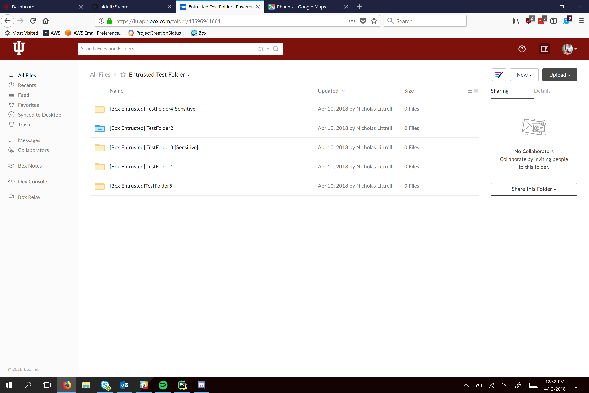
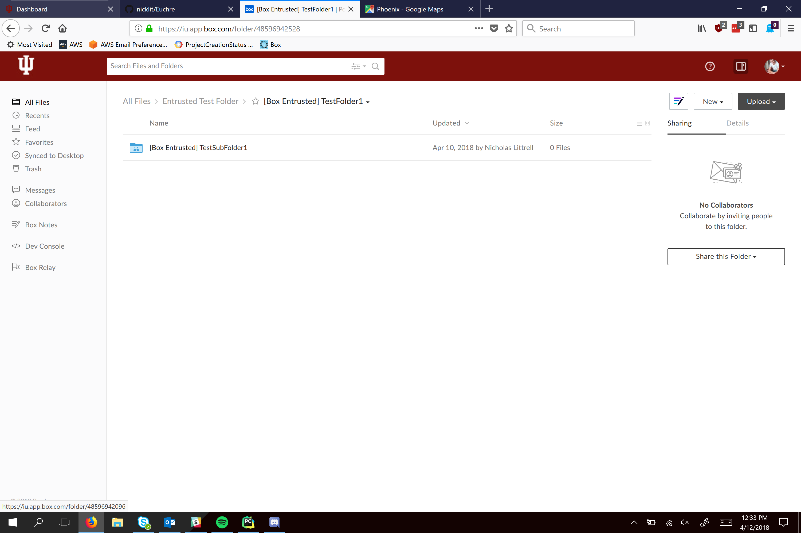

# collaborators

## Install
```
pip install -r requirements.txt
```

## Overview

**Set up your project with config.py before running this to authenticate to box.**

**Do not upload your keys in auth/config.py to github. Store them elsewhere if possible to prevent accidental upload. (For Example: C:\Python27\Lib)**

* Entrusted Toolkit
    * `Collab.py` class stores a folder, its collaborators, and its parent. Used for `collaborations.py`
    * `collaborators.py` recursively searches for new collaborators and outputs them. 
   
## Configuration
Configure `user_id` and `base_folder` to choose the account and folder to run on

## Examples 
Setup


Original Folders



Example output


