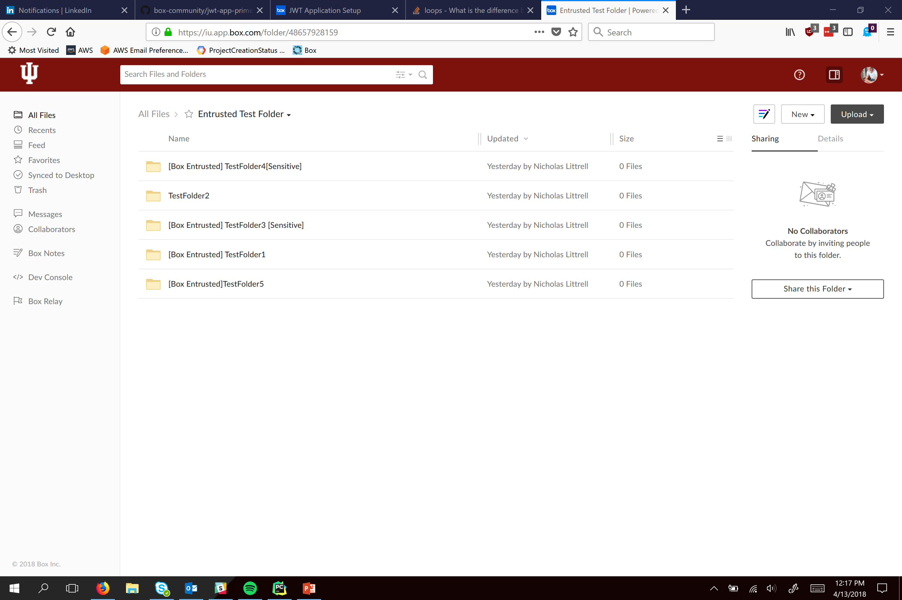

# verifyName

## Install
```
pip install -r requirements.txt
```

## Overview

**Set up your project with config.py before running this to authenticate to box.**

**Do not upload your keys in auth/config.py to github. Store them elsewhere if possible to prevent accidental upload. (For Example: C:\Python27\Lib)**

* Entrusted Toolkit
    * `verifyName.py` verifies a prefix from `prefix_list` is included in every folder underneath the given folder.

## Configure
Configure `user_id` and `base_folder` to choose the account and folder to run on.

Also configure `prefix_list` in `verifyName.py` for the prefixes you want to verify

## Example

Input


output folders that do not comply


